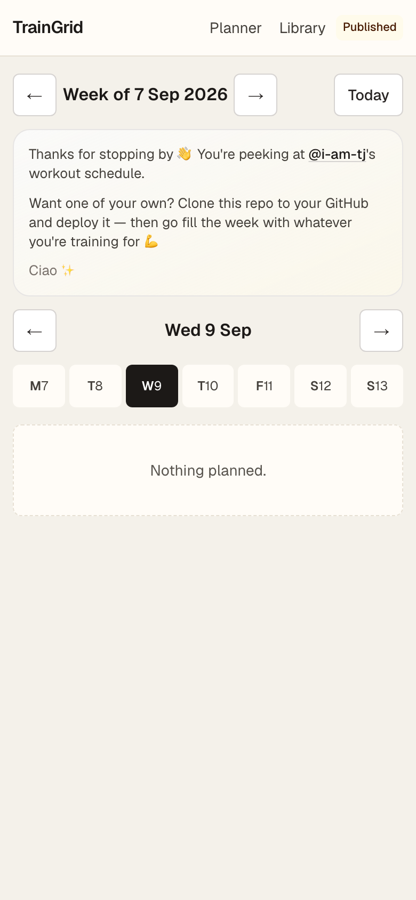
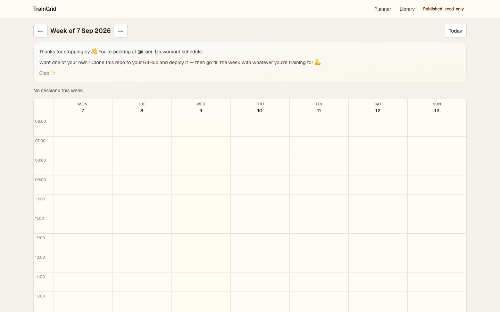
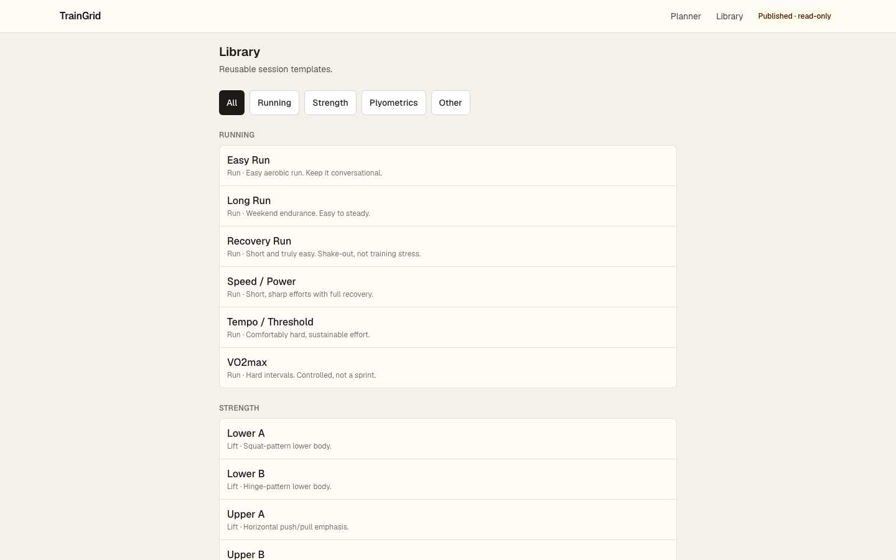
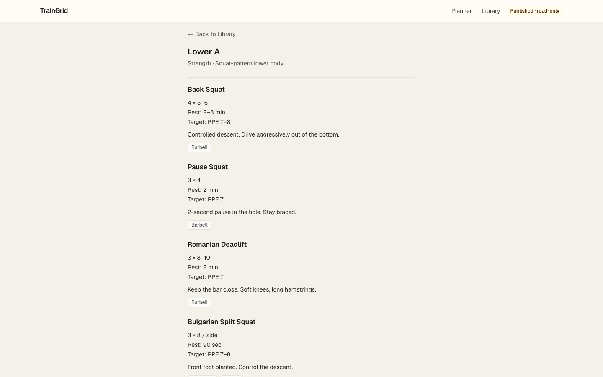

# TrainGrid

Plan the week. Show up. Don’t overthink it.

**TrainGrid** is a personal training planner — a Monday–Sunday calendar, reusable session templates, and a straight answer to “what am I doing today?”  
It is **not** a workout logger. Keep Strava / Hevy for that.

<br />

<p align="center">
  
  &nbsp;&nbsp;&nbsp;
  
</p>

<p align="center"><em>Published view — peek, don’t edit. Clone it if you want your own.</em></p>

<p align="center">
  
  &nbsp;&nbsp;&nbsp;
  
</p>

<p align="center"><em>Library of running, strength, and plyometrics templates — open one and see the work.</em></p>

---

## Why this exists

Most “fitness apps” want accounts, feeds, and streak guilt. TrainGrid is the opposite:

- Your plan lives in **files** you own (`data/`)
- You edit **locally**, publish by **pushing to Git**
- A hosted site (Vercel, etc.) is a **read-only showcase** of whatever you’ve committed

The default schedule is empty on purpose. Visitors see a friendly hello — not a shared spreadsheet.

```text
npm run dev  →  plan the week  →  commit data/  →  push  →  live site updates
```

| Where | What you get |
| --- | --- |
| Local | Full editor — add sessions, tweak templates, duplicate weeks |
| Hosted | Read-only published plan — clone the repo to make yours |

---

## What’s in the box

- **7-day planner** with timed + untimed sessions
- Seed templates for **running**, **strength**, **plyometrics**, warm-ups & cooldowns
- Optional **equipment** tags and **YouTube** demo links
- Duplicate a week, export JSON (local)
- Published mode that politely tells guests to deploy their own copy

More detail: [docs/](docs/README.md)

---

## Get your own copy

Needs **Node.js 20+**.

```bash
git clone https://github.com/i-am-tj/TrainGrid.git
cd TrainGrid
npm install
npm run dev
```

Open [http://localhost:3000](http://localhost:3000) — that’s your writable planner.

```bash
npm run build && npm start   # production locally
npm test                     # Vitest
npm run test:e2e             # Playwright
```

Deploy the same repo to Vercel (or similar) when you want a public, read-only view of your committed `data/`.

```text
traingrid/
├── app/                 # Next.js routes
├── components/
├── lib/
├── data/
│   ├── templates/       # session templates (Markdown)
│   └── schedule.json    # your published week(s) — empty by default
├── e2e/
└── docs/
```

---

## Say hello

Built by **Tanuj Chakraborty**.

If you have questions, suggestions, or need a hand — reach out anytime:

| | |
| --- | --- |
| **Email** | [tanuj.chakraborty21@gmail.com](mailto:tanuj.chakraborty21@gmail.com) |
| **GitHub** | [github.com/i-am-tj](https://github.com/i-am-tj) |
| **LinkedIn** | [linkedin.com/in/i-am-tj](https://www.linkedin.com/in/i-am-tj) |

Thanks for stopping by — ciao ✨
